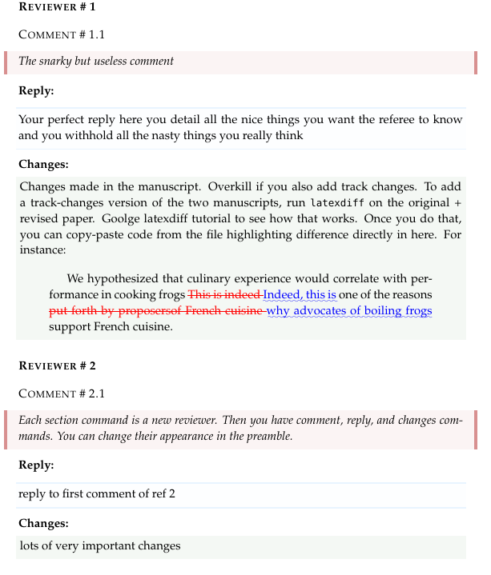

# A reply-to-referee LaTeX template

A template to reply to referees in style. Includes color markup, different commands for replies and to summarise or highlight changes, referee and comment numbering, and support for latexdiff to highlight the changes made in a "track-changes" style.

## Howto

Just copy the `Example.tex` and `header.tex` in a directory fo your choice. Compile `Example.tex`. Install any packages that you might not have installed and that do not allow you to compile (it does compile out of the box on **Overleaf**). Rename and edit `Example.tex` to suit your needs. Done.

## Commands

The file provides you with the following commands

`\comment{}`: here you copy the comment fo the referee. 

`\reply{}`: here you write your reply. You can add images, quote,s math, anything; it is just a container for any LaTeX code you'd like to add (not true: some things might break it -- e.g. fancy LaTeX commands or `\renewcommand` environments. Just don't be too pushy. I don't exactly know.)

`\changes{}`: here you write down the changes you've made. What I usually do is to use a `quotation` environment; and then within this, I use `latexdiff` to generate diff. _Note_: this template just _supports_ `latexdiff` and _does not_ run `latexdiff` for you. So first you have to install and run `latexdiff` on your draft and revised .tex manuscripts, following e.g. [**this guide from Overleaf**](https://www.overleaf.com/learn/latex/Articles/How_to_use_latexdiff_on_Overleaf); then just copy-paste your latexdiff-generated code into the reply. 

## Credits

Frankly, I forgot. I took this from the web some years ago. I complemented it with another template I got from [Matteo Ploner (@ploteo)](https://matteoploner.eco.unitn.it). I made my own changes. Bottom line is: use it, improve it, share it back. We all win.  